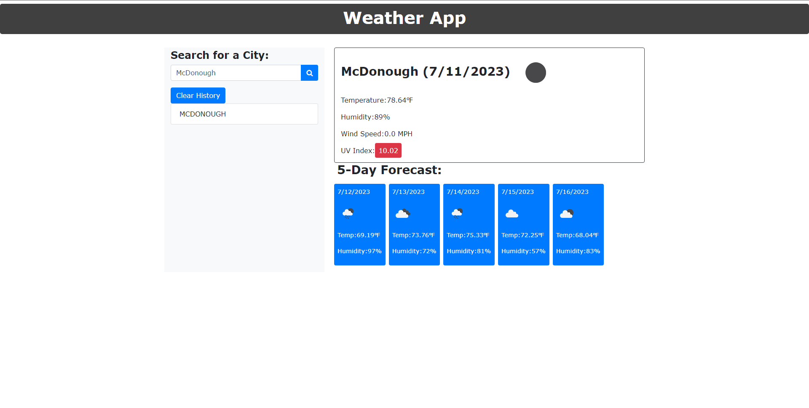

# Weather App

## Description

The Weather App is a web application that provides weather forecasts for different cities. It allows users to search for a specific city and retrieve the current weather conditions as well as a 5-day forecast. The application uses the OpenWeatherMap API to fetch weather data.

## Features

- Search for a city: Enter the name of a city in the search box and click the search button to retrieve weather information.
- Current Weather: The current weather section displays the city name, date, temperature, humidity, wind speed, and UV index.
- 5-Day Forecast: The forecast section shows the weather forecast for the next five days, including date, temperature, and humidity.
- Search History: The application keeps track of the searched cities and displays them as a list for easy access.

## Usage

1. Enter a city name in the search box.
2. Click the search button or press Enter.
3. The current weather and forecast for the city will be displayed.
4. To view the weather for a previously searched city, click on its name in the search history list.
5. To clear the search history, click the "Clear History" button.

## Technologies Used

- HTML
- CSS
- JavaScript
- jQuery
- Bootstrap

## APIs Used

- OpenWeatherMap API

## Setup

1. Clone the repository or download the project files.
2. Open the `index.html` file in a web browser.
3. Start searching for weather information by entering a city name.

## Credits

- This application was created by [Alan Paccor].
- The weather data is provided by the [OpenWeatherMap API](https://openweathermap.org/api).

## License

This project is licensed under the [MIT License](LICENSE).

